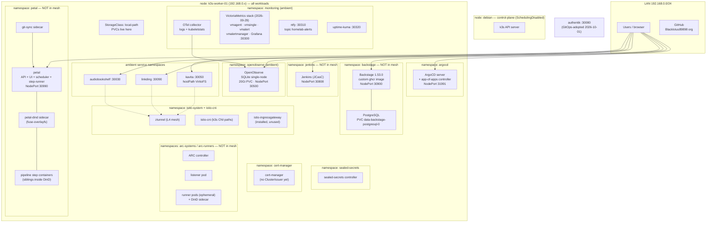
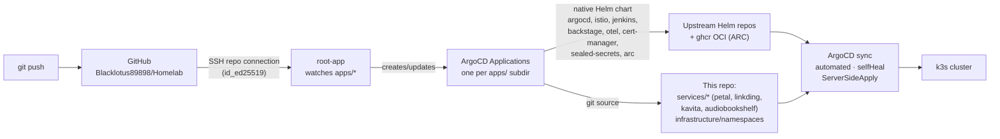
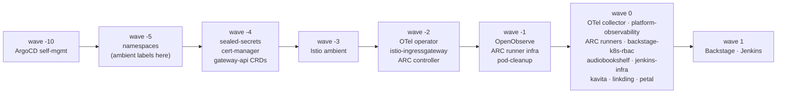
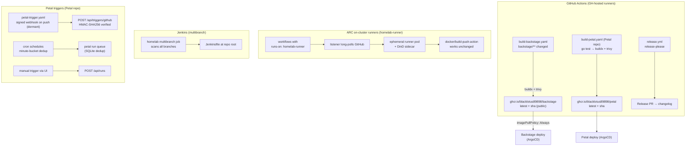
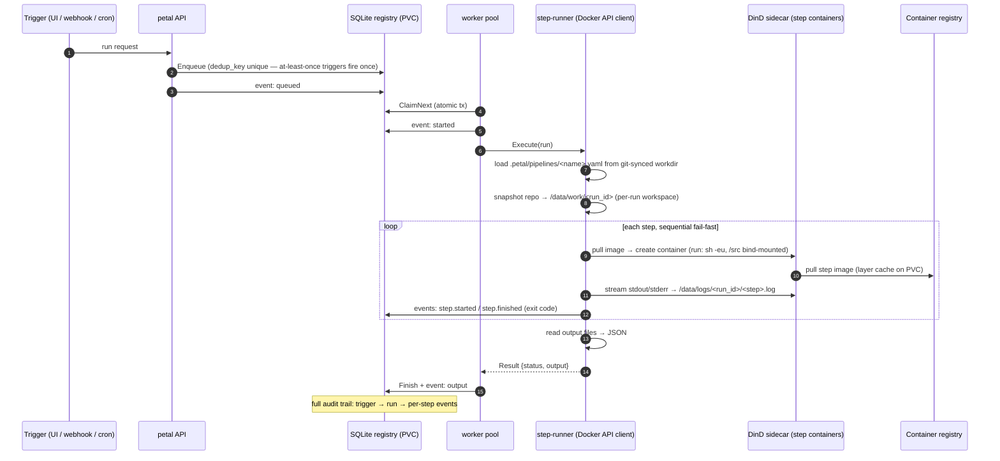
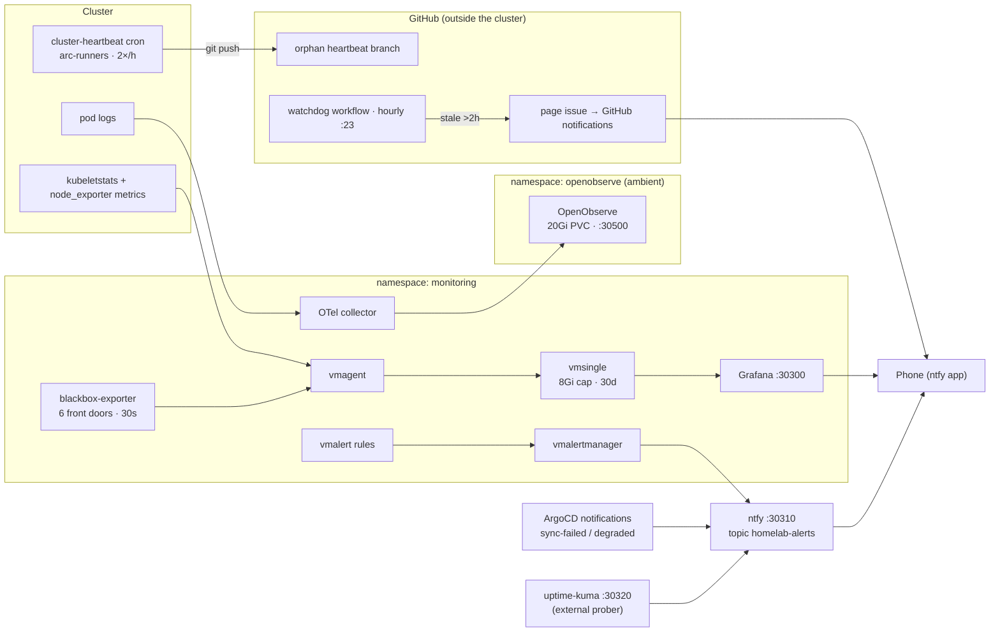
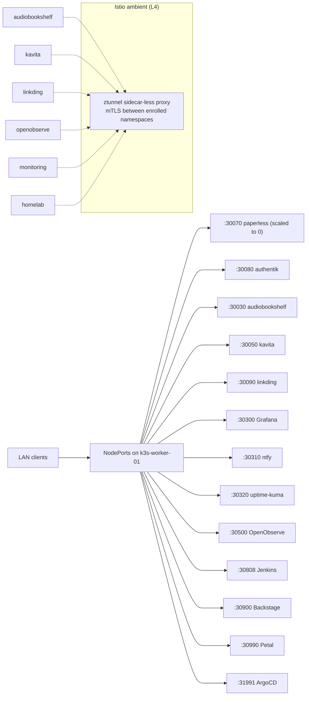
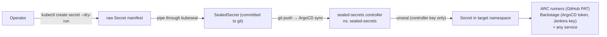

# Homelab Architecture

Full architectural picture of the cluster, rendered with [Mermaid](https://mermaid.js.org).
Pair with the [README](../README.md) for operational commands and known issues.

- [Cluster overview](#cluster-overview)
- [GitOps flow (app-of-apps)](#gitops-flow)
- [Sync waves](#sync-waves)
- [CI/CD flows](#cicd-flows)
- [Petal pipeline run (end to end)](#petal-pipeline-run)
- [Observability](#observability)
- [Traffic and network](#traffic-and-network)
- [Secrets flow](#secrets-flow)

---

## Cluster overview

Two nodes. The control plane is cordoned (`SchedulingDisabled`) — every workload lands on
`k3s-worker-01`, which is why every namespace has a LimitRange and DinD namespaces are sized carefully.

---

## GitOps flow

Everything is declared in this repo; ArgoCD reconciles it. The root app-of-apps
(`bootstrap/root-app.yaml`, applied once by hand) watches `apps/` — each subdir is an
Application that points either at this repo (raw manifests or Helm-with-git-values) or
at an upstream Helm/OCI chart.

Adding a service = one new subdir under `apps/` + a namespace + a LimitRange — the root
app picks it up on the next sync. See README "Adding a new service".

---

## Sync waves

Resources inside each app are annotated with `argocd.argoproj.io/sync-wave` so the
bootstrap order is deterministic:

Namespaces carry their Istio ambient label at creation time (wave -5) so pods in
enrolled namespaces never start outside the mesh.

---

## CI/CD flows

Three build/trigger paths coexist. GH-hosted runners build container images;
on-cluster runners and Jenkins run jobs that need cluster-adjacent resources.

---

## Petal pipeline run

The core principle: **Petal decides and remembers; Docker runs; YAML describes.**
Every trigger funnels into one deduplicated queue (SQLite, unique `dedup_key`), a
small worker pool executes runs via the first-party step-runner (ADR 0002 — it
superseded the original Dagger-engine executor), and every state change lands in
the append-only event log.

Step containers are **plain siblings in the DinD sidecar**: petal talks the
Docker Engine API to the `petal-dind` privileged sidecar
(`DOCKER_HOST=tcp://127.0.0.1:2375`, fuse-overlayfs storage driver) — the same
DinD pattern the ARC runners use. No engine, no SDK, no docker CLI.

---

## Observability

Two stacks, split by disk cost (see `docs/ROADMAP.md` standing constraints):

- **Logs**: OTel collector → OpenObserve (SQLite single-node, 20Gi PVC, 30-day compaction, `:30500`). Traces (Petal Phase C) are the next leg.
- **Metrics + alerting** (2026-09-29, VictoriaMetrics single-binary — NOT kube-prometheus-stack): vmagent scrapes → vmsingle (PVC capped 8Gi, 30d retention) → Grafana `:30300`. vmalert rules (OOMKill, disk >80%, node NotReady etc.) fire via vmalertmanager → **ntfy** `:30310`, topic `homelab-alerts` (max 3 per alert, send_resolved; structural false-positives blackholed). E2E-verified.
- **Front-door SLOs** (2026-10-08): blackbox-exporter probes the six in-cluster service endpoints (petal, backstage, kavita, linkding, argocd, grafana) every 30s via a VMProbe — no gateway exists yet, so the services themselves are the front doors; external reachability stays uptime-kuma's job. `VmRule front-door-slo` tracks a 99%/30d availability objective plus p99 latency <1s, and pages multiwindow burn-rate alerts (14.4× fast-burn critical, 6× slow-burn warning, hard-down critical) on the same ntfy topic. vmalert/vmagent pick up any-namespace VM CRs automatically (`selectAllByDefault`).

Two more paging paths land on the same topic: **uptime-kuma** `:30320` (external prober for NodePorts + control-plane TCP 6443) and **ArgoCD notifications** (on-sync-failed / on-health-degraded, global subscription) — one phone subscription covers everything. The cluster-down gap is being closed by a **dead-man switch** (built 2026-10-07; **not yet E2E-verified** — cluster-side pushes fail on an expired PAT, and the watchdog's page step had a bug fixed 2026-10-08): the `cluster-heartbeat` CronJob (arc-runners, 2×/h) pushes to the orphan `heartbeat` branch on GitHub, and a GitHub Actions watchdog (hourly) opens a "Cluster dark?" issue if the branch goes >2h stale — the only page path that survives the whole cluster being down. The vmalertmanager message body is raw JSON — a formatting bridge is a Phase 2 roadmap item.

---

## Traffic and network

No Ingress yet — everything is plain-HTTP NodePort, which is why most service
namespaces are **excluded** from the ambient mesh (ztunnel intercepts and drops
unencrypted NodePort traffic). `platform/gateways/` is empty pending the Istio
Gateway/HTTPRoute + cert-manager work.

| Namespace | In mesh? | Why |
|---|---|---|
| monitoring, openobserve, homelab, kavita, linkding, audiobookshelf | ✅ | no NodePort exposure conflict |
| backstage, jenkins, petal | ❌ | plain-HTTP NodePort access |
| arc-systems | ❌ | webhook TLS conflicts with ztunnel |
| arc-runners | ❌ | DinD conflicts with ambient |

---

## Secrets flow

Secrets are never stored plaintext in git (two known exceptions tracked in
`todo.md`: OpenObserve's secret and the Backstage postgres password). `kubeseal`
encrypts against the controller's key; only the in-cluster controller can decrypt.

Sealed secrets in the repo: ARC GitHub PAT (`infrastructure/arc-runners/`),
Backstage ArgoCD token + Jenkins API key (`infrastructure/backstage-k8s-rbac/`).
Rotation procedures for each are in the README.
